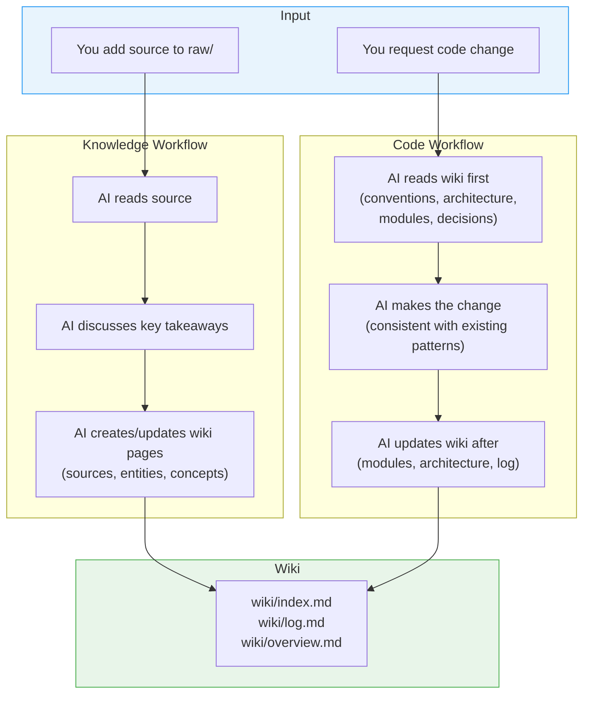

# AI Development Framework

A reusable template for AI-assisted development. The AI maintains a persistent wiki that tracks both knowledge (documents, research) and codebase context (architecture, modules, decisions, conventions) — so it never loses context as your project grows.

## Quick Start

### Option A: New Project (GitHub Template)

Click **"Use this template"** on the [GitHub repo](https://github.com/thongton11314/agent-coding-template) → creates a new repo with the framework pre-loaded.

### Option B: Existing Project (Setup Script)

**Linux / macOS:**
```bash
curl -sL https://raw.githubusercontent.com/thongton11314/agent-coding-template/main/scripts/setup.sh | bash
```

**Windows (PowerShell):**
```powershell
irm https://raw.githubusercontent.com/thongton11314/agent-coding-template/main/scripts/setup.ps1 | iex
```

The script creates all directories and files, skipping any that already exist in your project.

### Option C: Tell Your AI to Install It

In any AI chat inside your project, say:

> "Clone github.com/thongton11314/agent-coding-template and run `scripts/setup.ps1` (or `setup.sh`) to install the AI development framework into this project."

The AI runs the setup script → framework is installed → AI reads `AGENTS.md` → ready.

### Supported AI Tools

Once the framework files are in your project, the AI tool auto-detects its config:

   | AI Tool | Config File | Auto-loaded? |
   |---------|------------|:---:|
   | GitHub Copilot | `.github/copilot-instructions.md` | Yes |
   | OpenAI Codex | `AGENTS.md` | Yes |
   | Claude Code | `CLAUDE.md` | Yes |
   | Cursor | `.cursorrules` | Yes |
   | Windsurf | `.windsurfrules` | Yes |
   | Cline / Roo Code | `.clinerules` | Yes |

All config files point to `AGENTS.md` as the single source of truth.

## How It Works



The wiki compounds over time. Every source ingested and every code change enriches it.

## Multi-Agent Orchestration Template

The framework includes `framework-template.md` — a reusable specification template for building applications with a multi-agent pipeline. Eight specialized AI agents collaborate through 8 sequential phases:

| Phase | Name | Lead Agent |
|-------|------|-----------|
| 1 | Product and Scope | Product Strategist |
| 2 | UX and Design | UX/UI Designer |
| 3 | Technical Architecture | Solution Architect |
| 4 | Data and Integration | Data/API Integration Designer |
| 5 | Security, Quality, and Ops | QA/Test Engineer |
| 6 | Roadmap and Planning | Product Strategist |
| 7 | Implementation and Validation | Full-Stack Engineer |
| 8 | Documentation and README | Full-Stack Engineer |

### How to Use the Template

1. Copy `framework-template.md` → rename for your project (e.g. `my-app-spec.md`)
2. Replace all `{PLACEHOLDER}` tokens with your project-specific values
3. Fill in `[CUSTOMIZE]` sections — leave `[FRAMEWORK]` sections as-is
4. Place the completed spec in `raw/` (e.g. `raw/prompt.md`)
5. Tell your AI: *"Read `raw/prompt.md` and start Phase 1"*

The agents produce all deliverables as wiki artifacts, building a living specification that drives implementation in Phase 7.

### The Eight Agents

| # | Agent | Responsibility |
|---|-------|---------------|
| 0 | Orchestrator | Coordinates agents, enforces phase gates, resolves conflicts |
| 1 | Product Strategist | Scope, priorities, tradeoffs, roadmap, risk |
| 2 | UX/UI Designer | Layouts, flows, states, accessibility, design system |
| 3 | Solution Architect | System design, APIs, security, tech stack (scored matrix) |
| 4 | Full-Stack Engineer | Code implementation per wiki specs |
| 5 | Data/API Integration | External APIs, domain calculations, data processing |
| 6 | QA/Test Engineer | Test strategy, security model, release readiness |
| 7 | Visual Test Agent | Browser-based visual testing via Playwright |

Each phase has **quality gates** and **cross-agent reviews** — no phase starts until the prior one passes.

## Structure

```
raw/                  # Your source documents (immutable)
wiki/                 # AI-maintained pages (don't edit manually)
  sources/            # Summaries of ingested documents
  entities/           # People, orgs, products, tools
  concepts/           # Ideas, frameworks, patterns
  analyses/           # Comparisons, syntheses
  architecture/       # System design, data flows
  modules/            # One page per component/service
  decisions/          # Architecture Decision Records
  conventions/        # Coding standards, project patterns
  index.md            # Master catalog of all pages
  log.md              # Chronological operation record
  overview.md         # High-level synthesis
AGENTS.md             # Schema — the single source of truth
framework-template.md # Multi-agent orchestration template
scripts/              # Validation and maintenance tools
```

## Key Commands

| Action | What to Say |
|--------|------------|
| Ingest a source | "Ingest `raw/my-article.md`" |
| Ask a question | "What does the wiki say about X?" |
| Health check | "Lint the wiki" |
| Create analysis | "Compare X and Y across sources" |

## Validation

Run the wiki health check script:

**Windows (PowerShell):**
```powershell
pwsh scripts/validate-wiki.ps1
```

**Linux / macOS (Bash):**
```bash
bash scripts/validate-wiki.sh
```

Checks for: missing frontmatter, broken `[[wikilinks]]`, orphan pages, filename conventions, index coverage, and stale `source_paths` (warning only).

### Cleanup & Deprecation Sync

As your codebase evolves — files deleted, modules renamed, patterns retired — the wiki must follow. This template bakes that into the agent's contract via **Workflow 11 (Deprecation & Cleanup Sync)** in [`AGENTS.md`](AGENTS.md).

**How it works:**

- **`source_paths` frontmatter** (optional, recommended on `module`, `architecture`, `convention` pages) — a YAML array of repo-relative paths the page documents. The validator flags any path that no longer exists.
  ```yaml
  source_paths:
    - src/auth/login.ts
    - src/auth/session.ts
  ```
- **Status lifecycle** — pages carry a `status` field. Allowed values: `active`, `draft`, `deprecated`, `superseded`, `spec`, `verified`.
  - `spec` — the page describes intended behavior before code exists.
  - `verified` — the page has been reconciled against shipped code.
  - `deprecated` / `superseded` — the page is kept as historical record, never deleted.
- **Warn-only detection** — stale `source_paths` produce `[WARN]` output but do **not** fail validation. Deprecation is a deliberate, user-approved action (see AGENTS.md Workflow 11), not an automatic one.
- **Deprecation over deletion** — the agent never hard-deletes wiki pages. It flips `status`, adds a dated `> [!deprecated]` or `> [!breaking]` callout, and updates `wiki/index.md` + `wiki/log.md`.

When you delete or rename code, ask the agent to "run the cleanup sync" — it will scan for affected pages, classify each (Relocated / Superseded / Deprecated / Still accurate), and present a proposal table for your approval before touching anything.

## Example

The template ships with one ingested example:

- **Source**: `raw/rest-api-design-best-practices.md`
- **Generated pages**: source summary, 3 concept pages (REST, API Design Patterns, HTTP Status Codes), 1 entity page (Sarah Chen)
- **Updated**: `wiki/index.md`, `wiki/log.md`, `wiki/overview.md`

This shows exactly what the AI produces from a single ingest operation.

## Customization

All conventions live in `AGENTS.md`. Modify it to:
- Add new page types or wiki categories.
- Change frontmatter fields.
- Adjust workflows for your team's needs.
- Add domain-specific conventions.

The editor config files (`.cursorrules`, `CLAUDE.md`, etc.) all point to `AGENTS.md` — update once, works everywhere.

