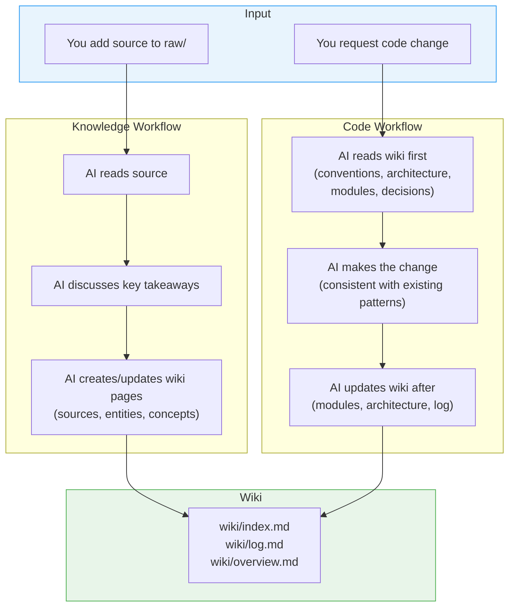

# AI Development Framework

A reusable template for AI-assisted development. The AI maintains a persistent wiki that tracks both knowledge (documents, research) and codebase context (architecture, modules, decisions, conventions) — so it never loses context as your project grows.

## Quick Start

### Option A: New Project (GitHub Template)

Click **"Use this template"** on the [GitHub repo](https://github.com/thongton11314/agent-coding-template) → creates a new repo with the framework pre-loaded.

### Option B: Existing Project (Setup Script)

**Linux / macOS:**
```bash
curl -sL https://raw.githubusercontent.com/thongton11314/agent-coding-template/main/scripts/setup.sh | bash
```

**Windows (PowerShell):**
```powershell
irm https://raw.githubusercontent.com/thongton11314/agent-coding-template/main/scripts/setup.ps1 | iex
```

The script creates all directories and files, skipping any that already exist in your project.

### Option C: Tell Your AI to Install It

In any AI chat inside your project, say:

> "Clone github.com/thongton11314/agent-coding-template and run `scripts/setup.ps1` (or `setup.sh`) to install the AI development framework into this project."

The AI runs the setup script → framework is installed → AI reads `AGENTS.md` → ready.

## How It Works



The wiki compounds over time. Every source ingested and every code change enriches it.

## Core Principles

Two disciplines govern every agent action — defined in full in [`AGENTS.md`](AGENTS.md#guiding-principles).

**Wiki Discipline** — The wiki is the product · Compound, don't repeat · Flag conflicts explicitly · Cross-reference aggressively · Human curates, LLM maintains.

**Coding Discipline**
- **P1. Think Before Coding** — State assumptions, surface interpretations, stop when confused.
- **P2. Simplicity First** — No unrequested features or abstractions; prefer the 50-line rewrite over the 200-line patch.
- **P3. Surgical Changes** — Touch only what the task requires; match surrounding style.
- **P4. Goal-Driven Execution** — Plans use the format `N. [Step] → verify: [check]`.

These principles apply to every workflow: before the change (Workflow 4), after the change (Workflow 5), and at every step of the Post-Change Pipeline.

## Agent Model

The framework uses a **single developer agent** with modular skills, not multiple specialized agents. This keeps the system generic and reusable across any project type.

### Developer Agent Skills

| Skill | Purpose |
|-------|---------|
| **Plan** | Read requirements, identify affected wiki pages, break work into tasks with verify steps |
| **Implement** | Write code following conventions, match existing patterns, create tests |
| **Test** | Run test suite, verify changes, fix failures |
| **Wiki Sync** | Update wiki pages, run Sync Gate, maintain index/log/overview |
| **Review** | Lint wiki, check code↔wiki consistency, flag contradictions |
| **Commit** | Stage files, write structured commit messages, push to remote |

### Exploration Agent

A read-only agent for searching the codebase and answering questions. It never modifies files, runs commands, or updates the wiki.

## Platform Integrations

The framework is **platform-agnostic**. [`AGENTS.md`](AGENTS.md) is the single source of truth — every platform-specific config file either delegates to it or duplicates its contract verbatim. The same triggers, the same Post-Change Pipeline, and the same read-only Exploration mode run on every platform; only the dispatch mechanism differs.

### Cross-Platform Comparison

| Platform | Root entry-point | Subagent directory | Dispatch model | Auto-detected? |
|----------|------------------|--------------------|----------------|----------------|
| **VS Code (GitHub Copilot)** | [.github/copilot-instructions.md](.github/copilot-instructions.md) | `.github/agents/` | Native subagents (`@agent-developer`, `@explore`) | Yes — on workspace open |
| **Claude Code** | [CLAUDE.md](CLAUDE.md) | `.claude/agents/` | Native subagents (Task tool / by name) | Yes — on session start |
| **Codex (OpenAI CLI)** | [AGENTS.md](AGENTS.md) | *(none — single-agent)* | Behavioral-mode switch inlined in `AGENTS.md` | Yes — reads `AGENTS.md` at repo root |

> Why three layouts for one framework? Codex has no native subagent file convention — it only reads `AGENTS.md` at the repo root. So Codex gets the agent contract inlined as a behavioral switch, while VS Code and Claude Code get mirrored subagent files. The behavior is identical across all three. See [ADR-001](wiki/decisions/adr-001-cross-platform-agent-orchestration.md) for the design rationale.

### Install (all platforms)

The setup script installs every platform's files in one pass. Run it once and the project works in VS Code, Claude Code, and Codex simultaneously.

**Windows (PowerShell):**
```powershell
irm https://raw.githubusercontent.com/thongton11314/agent-coding-template/main/scripts/setup.ps1 | iex
```

**Linux / macOS (Bash):**
```bash
curl -sL https://raw.githubusercontent.com/thongton11314/agent-coding-template/main/scripts/setup.sh | bash
```

The script is idempotent — files that already exist are skipped, so it's safe to re-run.

---

### VS Code (GitHub Copilot)

**Files installed:**
- [.github/copilot-instructions.md](.github/copilot-instructions.md) — loaded on every Copilot interaction; routes to subagents
- `.github/agents/agent-developer.md` — developer subagent (full Post-Change Pipeline)
- `.github/agents/explore.md` — read-only exploration subagent

**How to use:**
1. Install the framework (see Quick Start or the install command above).
2. Open the project in VS Code with GitHub Copilot enabled.
3. Copilot auto-loads `.github/copilot-instructions.md` on workspace open.
4. Use `@agent-developer` for any code/wiki change, `@explore` for read-only queries. Plain chat messages are also auto-routed by the rules in `copilot-instructions.md`.

**Verify it's working:** ask Copilot Chat *"what is the post-change pipeline?"* — it should answer from `AGENTS.md` without searching the web.

---

### Claude Code

**Files installed:**
- [CLAUDE.md](CLAUDE.md) — root entry-point; delegates to `.claude/agents/`
- `.claude/agents/agent-developer.md` — developer subagent (byte-identical mirror of `.github/agents/agent-developer.md`)
- `.claude/agents/explore.md` — read-only exploration subagent

**How to use:**
1. Install the framework.
2. Open the project with Claude Code (`claude` CLI or Claude Desktop project mode).
3. Claude Code auto-loads `CLAUDE.md` and discovers subagents under `.claude/agents/`.
4. Code-change requests delegate to `agent-developer`; read-only queries delegate to `Explore`. Invoke explicitly with *"use the agent-developer subagent to ..."* or via the Task tool.

**Verify it's working:** ask *"which subagent handles bug fixes?"* — it should name `agent-developer` and cite the routing rules from `CLAUDE.md`.

---

### Codex (OpenAI Codex CLI)

**Files installed:**
- [AGENTS.md](AGENTS.md) — the full schema. Codex reads this directly; no separate subagent files.

**How to use:**
1. Install the framework.
2. Open the project with Codex (`codex` CLI in the repo root).
3. Codex automatically reads `AGENTS.md` as the primary instruction file.
4. Codex runs as a single agent. The **Agent Routing — FIRST RULE** at the top of `AGENTS.md` switches it between **Developer Agent mode** (full Post-Change Pipeline) and **Exploration Agent mode** (read-only) based on the request's trigger words. Same triggers as VS Code and Claude Code.

**Verify it's working:** ask *"what should you do before any code change?"* — it should walk through the Pre-Change Checklist from `AGENTS.md` Workflow 4.

---

### Other Platforms

Any AI tool that supports custom instructions can adopt this framework:

1. Point the tool's instruction/config file at `AGENTS.md`. Most tools accept a one-liner like:
   ```
   Read AGENTS.md in full before every session. Apply its Agent Routing — FIRST RULE.
   ```
2. If the tool supports subagents, mirror `.github/agents/agent-developer.md` and `.github/agents/explore.md` into the tool's expected directory.
3. If the tool is single-agent (like Codex), no extra files are needed — the routing rule inside `AGENTS.md` handles the mode switch.

All workflows, conventions, and principles live in `AGENTS.md` — no platform-specific logic to port.

## Structure

```
src/                  # Application source code
  frontend/           # UI code (when the app has a user interface)
  backend/            # Server/API code (when the app has a server)
  cli/                # CLI scripts (when the app has no backend server)
raw/                  # Your source documents (immutable)
wiki/                 # AI-maintained pages (don't edit manually)
  sources/            # Summaries of ingested documents
  entities/           # People, orgs, products, tools
  concepts/           # Ideas, frameworks, patterns
  analyses/           # Comparisons, syntheses
  architecture/       # System design, data flows
  modules/            # One page per component/service
  decisions/          # Architecture Decision Records
  conventions/        # Coding standards, project patterns
  index.md            # Master catalog of all pages
  log.md              # Chronological operation record
  overview.md         # High-level synthesis
scripts/              # Setup, validation, and maintenance scripts
AGENTS.md             # Schema — the single source of truth
```

### Source Code Layout

When the user requests application code, the agent creates subdirectories in `src/` based on the project type:

- **Full-stack app** (UI + server) → `src/frontend/` + `src/backend/`
- **API-only app** (server, no UI) → `src/backend/`
- **Frontend-only app** (UI, no server) → `src/frontend/`
- **CLI/script app** (no server, no UI) → `src/cli/`

The setup script creates an empty `src/` directory. Subdirectories are created on demand.

## Key Commands

| Action | What to Say |
|--------|------------|
| Ingest a source | "Ingest `raw/my-article.md`" |
| Ask a question | "What does the wiki say about X?" |
| Health check | "Lint the wiki" |
| Create analysis | "Compare X and Y across sources" |
| Brownfield onboard | "Run Workflow 11 to onboard this codebase" |

## Validation

Run the wiki health check script:

**Windows (PowerShell):**
```powershell
pwsh scripts/validate-wiki.ps1
```

**Linux / macOS (Bash):**
```bash
bash scripts/validate-wiki.sh
```

Checks for: missing frontmatter, broken `[[wikilinks]]`, orphan pages, filename conventions, index coverage, and stale `source_paths` (warning only).

### Cleanup & Deprecation Sync

As your codebase evolves — files deleted, modules renamed, patterns retired — the wiki must follow. This is baked into the agent's contract via **Workflow 10 (Deprecation & Cleanup Sync)** in [`AGENTS.md`](AGENTS.md).

**How it works:**

- **`source_paths` frontmatter** (optional, recommended on `module`, `architecture`, `convention` pages) — a YAML array of repo-relative paths the page documents. The validator flags any path that no longer exists.
  ```yaml
  source_paths:
    - src/auth/login.ts
    - src/auth/session.ts
  ```
- **Status lifecycle** — pages carry a `status` field. Allowed values: `active`, `draft`, `deprecated`, `superseded`, `spec`, `verified`.
  - `spec` — the page describes intended behavior before code exists.
  - `verified` — the page has been reconciled against shipped code.
  - `deprecated` / `superseded` — the page is kept as historical record, never deleted.
- **Warn-only detection** — stale `source_paths` produce `[WARN]` output but do **not** fail validation. Deprecation is a deliberate, user-approved action (see AGENTS.md Workflow 10), not an automatic one.
- **Deprecation over deletion** — the agent never hard-deletes wiki pages. It flips `status`, adds a dated `> [!deprecated]` or `> [!breaking]` callout, and updates `wiki/index.md` + `wiki/log.md`.

When you delete or rename code, ask the agent to "run the cleanup sync" — it will scan for affected pages, classify each (Relocated / Superseded / Deprecated / Still accurate), and present a proposal table for your approval before touching anything.

## Example

The template ships with one ingested example:

- **Source**: `raw/rest-api-design-best-practices.md`
- **Generated pages**: source summary, 3 concept pages (REST, API Design Patterns, HTTP Status Codes), 1 entity page (Sarah Chen)
- **Updated**: `wiki/index.md`, `wiki/log.md`, `wiki/overview.md`

This shows exactly what the AI produces from a single ingest operation.

## Customization

All conventions live in `AGENTS.md`. Modify it to:
- Add new page types or wiki categories.
- Change frontmatter fields.
- Adjust workflows for your team's needs.
- Add domain-specific conventions.

All platform config files point to `AGENTS.md` — update once, works everywhere.
