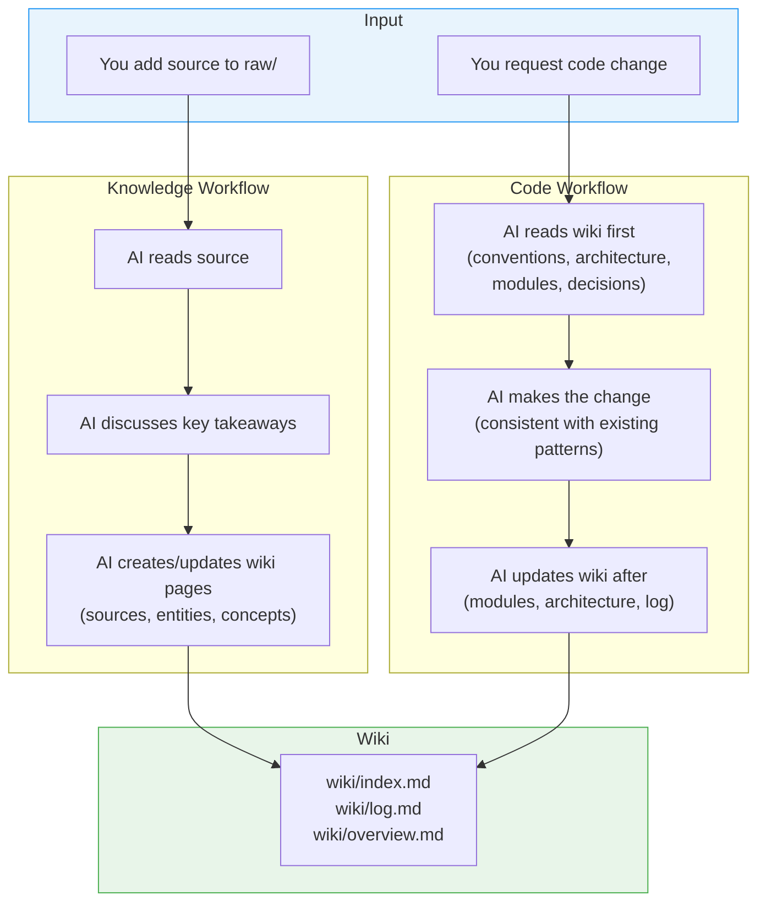

# AI Development Framework

A reusable template for AI-assisted development. The AI maintains a persistent wiki that tracks both knowledge (documents, research) and codebase context (architecture, modules, decisions, conventions) — so it never loses context as your project grows.

## Quick Start

### Option A: New Project (GitHub Template)

Click **"Use this template"** on the [GitHub repo](https://github.com/thongton11314/agent-coding-template) → creates a new repo with the framework pre-loaded.

### Option B: Existing Project (Setup Script)

**Linux / macOS:**
```bash
curl -sL https://raw.githubusercontent.com/thongton11314/agent-coding-template/main/scripts/setup.sh | bash
```

**Windows (PowerShell):**
```powershell
irm https://raw.githubusercontent.com/thongton11314/agent-coding-template/main/scripts/setup.ps1 | iex
```

The script creates all directories and files, skipping any that already exist in your project.

### Option C: Tell Your AI to Install It

In any AI chat inside your project, say:

> "Clone github.com/thongton11314/agent-coding-template and run `scripts/setup.ps1` (or `setup.sh`) to install the AI development framework into this project."

The AI runs the setup script → framework is installed → AI reads `AGENTS.md` → ready.

## How It Works



The wiki compounds over time. Every source ingested and every code change enriches it.

## Core Principles

Two disciplines govern every agent action — defined in full in [`AGENTS.md`](AGENTS.md#guiding-principles).

**Wiki Discipline** — The wiki is the product · Compound, don't repeat · Flag conflicts explicitly · Cross-reference aggressively · Human curates, LLM maintains.

**Coding Discipline**
- **P1. Think Before Coding** — State assumptions, surface interpretations, stop when confused.
- **P2. Simplicity First** — No unrequested features or abstractions; prefer the 50-line rewrite over the 200-line patch.
- **P3. Surgical Changes** — Touch only what the task requires; match surrounding style.
- **P4. Goal-Driven Execution** — Plans use the format `N. [Step] → verify: [check]`.

These principles apply to every workflow: before the change (Workflow 4), after the change (Workflow 5), and at every step of the Post-Change Pipeline.

## Agent Model

The framework uses a **single developer agent** with modular skills, not multiple specialized agents. This keeps the system generic and reusable across any project type.

### Developer Agent Skills

| Skill | Purpose |
|-------|---------|
| **Plan** | Read requirements, identify affected wiki pages, break work into tasks with verify steps |
| **Implement** | Write code following conventions, match existing patterns, create tests |
| **Test** | Run test suite, verify changes, fix failures |
| **Wiki Sync** | Update wiki pages, run Sync Gate, maintain index/log/overview |
| **Review** | Lint wiki, check code↔wiki consistency, flag contradictions |
| **Commit** | Stage files, write structured commit messages, push to remote |

### Exploration Agent

A read-only agent for searching the codebase and answering questions. It never modifies files, runs commands, or updates the wiki.

## How to Integrate to Platform

The framework is **platform-agnostic**. `AGENTS.md` is the single source of truth — every platform config file points to it. Three platforms are supported out of the box:

### VS Code (GitHub Copilot)

Auto-detected via `.github/copilot-instructions.md` and custom agents in `.github/agents/`.

**Files installed:**
- `.github/copilot-instructions.md` — rules loaded on every Copilot interaction
- `.github/agents/agent-developer.md` — developer agent with post-change pipeline
- `.github/agents/explore.md` — read-only exploration agent

**How to use:**
1. Install the framework (see Quick Start)
2. Open the project in VS Code with GitHub Copilot enabled
3. Copilot automatically loads `.github/copilot-instructions.md`
4. Use `@agent-developer` for code changes, `@explore` for read-only queries

### Claude (Claude Code)

Auto-detected via `CLAUDE.md` in the project root.

**Files installed:**
- `CLAUDE.md` — compact rules pointing to `AGENTS.md`

**How to use:**
1. Install the framework (see Quick Start)
2. Open the project with Claude Code
3. Claude automatically loads `CLAUDE.md` and follows the workflows in `AGENTS.md`

### Codex (OpenAI)

Auto-detected via `AGENTS.md` in the project root.

**Files installed:**
- `AGENTS.md` — the full schema (Codex reads this directly)

**How to use:**
1. Install the framework (see Quick Start)
2. Open the project with Codex
3. Codex reads `AGENTS.md` as the primary instruction file

### Other Platforms

Any AI tool that supports custom instructions can use this framework:

1. Point the tool's instruction/config file to read `AGENTS.md`
2. Add a one-line config file in the format your tool expects:
   ```
   Read `AGENTS.md` in full before every session.
   ```
3. The workflows, conventions, and principles all live in `AGENTS.md` — no platform-specific logic needed

## Structure

```
src/                  # Application source code
  frontend/           # UI code (when the app has a user interface)
  backend/            # Server/API code (when the app has a server)
  cli/                # CLI scripts (when the app has no backend server)
raw/                  # Your source documents (immutable)
wiki/                 # AI-maintained pages (don't edit manually)
  sources/            # Summaries of ingested documents
  entities/           # People, orgs, products, tools
  concepts/           # Ideas, frameworks, patterns
  analyses/           # Comparisons, syntheses
  architecture/       # System design, data flows
  modules/            # One page per component/service
  decisions/          # Architecture Decision Records
  conventions/        # Coding standards, project patterns
  index.md            # Master catalog of all pages
  log.md              # Chronological operation record
  overview.md         # High-level synthesis
scripts/              # Setup, validation, and maintenance scripts
AGENTS.md             # Schema — the single source of truth
```

### Source Code Layout

When the user requests application code, the agent creates subdirectories in `src/` based on the project type:

- **Full-stack app** (UI + server) → `src/frontend/` + `src/backend/`
- **API-only app** (server, no UI) → `src/backend/`
- **Frontend-only app** (UI, no server) → `src/frontend/`
- **CLI/script app** (no server, no UI) → `src/cli/`

The setup script creates an empty `src/` directory. Subdirectories are created on demand.

## Key Commands

| Action | What to Say |
|--------|------------|
| Ingest a source | "Ingest `raw/my-article.md`" |
| Ask a question | "What does the wiki say about X?" |
| Health check | "Lint the wiki" |
| Create analysis | "Compare X and Y across sources" |
| Brownfield onboard | "Run Workflow 11 to onboard this codebase" |

## Validation

Run the wiki health check script:

**Windows (PowerShell):**
```powershell
pwsh scripts/validate-wiki.ps1
```

**Linux / macOS (Bash):**
```bash
bash scripts/validate-wiki.sh
```

Checks for: missing frontmatter, broken `[[wikilinks]]`, orphan pages, filename conventions, index coverage, and stale `source_paths` (warning only).

### Cleanup & Deprecation Sync

As your codebase evolves — files deleted, modules renamed, patterns retired — the wiki must follow. This is baked into the agent's contract via **Workflow 10 (Deprecation & Cleanup Sync)** in [`AGENTS.md`](AGENTS.md).

**How it works:**

- **`source_paths` frontmatter** (optional, recommended on `module`, `architecture`, `convention` pages) — a YAML array of repo-relative paths the page documents. The validator flags any path that no longer exists.
  ```yaml
  source_paths:
    - src/auth/login.ts
    - src/auth/session.ts
  ```
- **Status lifecycle** — pages carry a `status` field. Allowed values: `active`, `draft`, `deprecated`, `superseded`, `spec`, `verified`.
  - `spec` — the page describes intended behavior before code exists.
  - `verified` — the page has been reconciled against shipped code.
  - `deprecated` / `superseded` — the page is kept as historical record, never deleted.
- **Warn-only detection** — stale `source_paths` produce `[WARN]` output but do **not** fail validation. Deprecation is a deliberate, user-approved action (see AGENTS.md Workflow 10), not an automatic one.
- **Deprecation over deletion** — the agent never hard-deletes wiki pages. It flips `status`, adds a dated `> [!deprecated]` or `> [!breaking]` callout, and updates `wiki/index.md` + `wiki/log.md`.

When you delete or rename code, ask the agent to "run the cleanup sync" — it will scan for affected pages, classify each (Relocated / Superseded / Deprecated / Still accurate), and present a proposal table for your approval before touching anything.

## Example

The template ships with one ingested example:

- **Source**: `raw/rest-api-design-best-practices.md`
- **Generated pages**: source summary, 3 concept pages (REST, API Design Patterns, HTTP Status Codes), 1 entity page (Sarah Chen)
- **Updated**: `wiki/index.md`, `wiki/log.md`, `wiki/overview.md`

This shows exactly what the AI produces from a single ingest operation.

## Customization

All conventions live in `AGENTS.md`. Modify it to:
- Add new page types or wiki categories.
- Change frontmatter fields.
- Adjust workflows for your team's needs.
- Add domain-specific conventions.

All platform config files point to `AGENTS.md` — update once, works everywhere.
